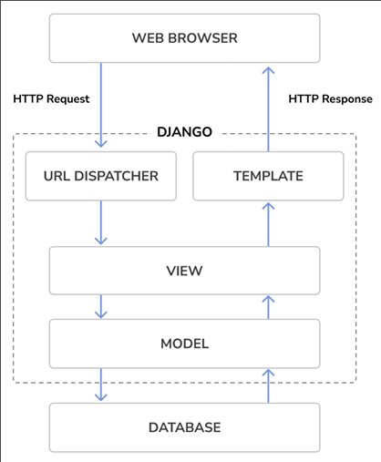

# Installing Django 4
If you have already installed Django 4.1, you can skip this section and jump directly to the Creating your first project section.
“The pip package management system is the preferred method of installing Django. Python 3.10 comes with pip preinstalled, but you can find pip installation instructions at https://pip.pypa.io/en/stable/installing/.
Run the following command at the shell prompt to install Django with pip:
pip install Django~=4.1.0

This will install Django’s latest 4.1 version in the Python site-packages/ directory of your virtual environment.
Now we will check whether Django has been successfully installed. Run the following command in a shell prompt:
python -m django --version

If you get the output 4.1.X, Django has

#New features in Django 4
Django 4 introduces a collection of new features, including some backward-incompatible changes, while deprecating other features and eliminating old functionalities. Being a time-based release, 
there is no drastic change in Django 4, and it is easy to migrate Django 3 applications to the 4.1 release. 
While Django 3 included for the first time Asynchronous Server Gateway Interface (ASGI) support, 
Django 4.0 adds several features such as functional unique constraints for Django models, 
built-in support for caching data with Redis, a new default timezone implementation using the standard Python package zoneinfo, 
a new scrypt password hasher, template-based rendering for forms, as well as other new minor features. 
Django 4.0 drops support for Python 3.6 and 3.7. It also drops support for PostgreSQL 9.6, Oracle 12.2, and Oracle 18c. 
Django 4.1 introduces asynchronous handlers for class-based views, an asynchronous ORM interface, 
new validation of model constraints and new templates for rendering forms. 
The 4.1 version drops support for PostgreSQL 10 and MariaDB 10.2.

You can read the complete list of changes in the Django 4.0 release notes at https://docs.djangoproject.com/en/dev/releases/4.0/ and the Django 4.1 release notes at https[…]”

#Django Overview
Django is a framework consisting of a set of components that solve common web development problems. 
Django components are loosely coupled, which “means they can be managed independently. 
This helps separate the responsibilities of the different layers of the framework; 
the database layer knows nothing about how the data is displayed, 
the template system knows nothing about web requests, and so on.
Django offers maximum code reusability by following the DRY (don’t repeat yourself) principle. 
Django also fosters rapid development and allows you to use less code by taking advantage of Python’s dynamic capabilities, 
such as introspection.
You can read more about Django’s design philosophies at https://docs.djangoproject.com/en/4.1/misc/design-philosophies/.

#Main framework components
Django follows the MTV (Model-Template-View) pattern. It is a slightly similar pattern to the well-known MVC (Model-View-Controller) pattern, where the Template acts as View and the framework itself acts as the Controller.
The responsibilities in the Django MTV pattern are divided as follows:

Model – Defines the logical data structure and is the data handler between the database and the View.
Template – Is the presentation layer. Django uses a plain-text template system that keeps everything that the browser renders.
View – Communicates with the database via the Model and transfers the data to the Template for viewing.

The framework itself acts as the Controller. It sends a request to the appropriate view, according to the Django URL configuration.
When developing any Django project, you will always work with models, views, templates, and URLs. In this chapter, you will learn how they fit together.

#The django architecture
Figure 1.1 shows how Django processes requests and how the request/response cycle is managed with the different main Django components: URLs, views, models, and templates:

This is how Django handles HTTP requests and generates responses:

1. A web browser requests a page by its URL and the web server passes the HTTP request to Django.
2. “Django runs through its configured URL patterns and stops at the first one that matches the requested URL.
3. Django executes the view that corresponds to the matched URL pattern.
4. The view potentially uses data models to retrieve information from the database.
5. Data models provide the data definition and behaviors. They are used to query the database.
6. The view renders a template (usually HTML) to display the data and returns it with an HTTP response.

We will get back to the Django request/response cycle at the end of this chapter in the The request/response cycle section.
Django also includes hooks in the request/response process, which are called middleware. Middleware has been intentionally left out of this diagram for the sake of simplicity. You will use middleware in different examples of this book, and you will learn how to create custom middleware in Chapter 17, Going Live.

#Creating Your firstDjango Project

