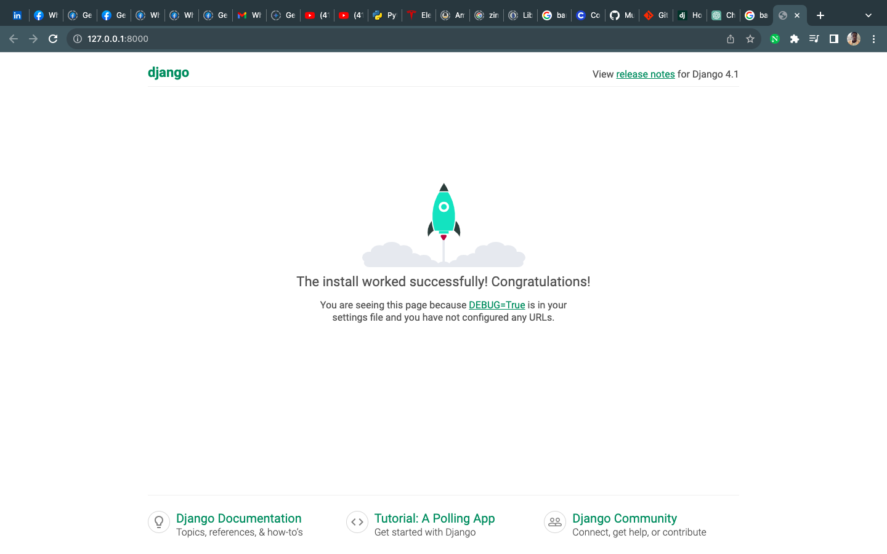
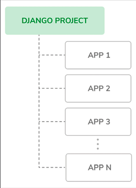

# First Django Project
Your first Django project will consist of a blog application. We will start by creating the Django project and a Django application for the blog. We will then create our data models and synchronize them to the database.
Django provides a command that allows you to create an initial project file structure. Run the following command in your shell prompt:
<pre>
```

django-admin startproject mysite

```
</pre>
This will create a Django project with the name mysite.

Let’s take a look at the generated project structure:

mysite/
    manage.py
    mysite/
      __init__.py
      asgi.py
      settings.py
      urls.py
      wsgi.py

The outer mysite/ directory is the container for our project. It contains the following files:

manage.py: This is a command-line utility used to interact with your project. You don’t need to edit this file.
mysite/: This is the Python package for your project, which consists of the following files:
__init__.py: An empty file that tells Python to treat the mysite directory as a Python module.
asgi.py: This is the configuration to run your project as an Asynchronous Server Gateway Interface (ASGI) application with ASGI-compatible web servers. ASGI is the emerging Python standard for asynchronous web servers and applications.
settings.py: This indicates settings and configuration for your project and contains initial default settings.
urls.py: This is the place where your URL patterns live. Each URL defined here is mapped to a view.
wsgi.py: This is the configuration to run your project as a Web Server Gateway Interface (WSGI) application with WSGI-compatible web servers.

# Applying initial database migrations

Django applications require a database to store data. The settings.py file contains the database configuration for your project in the DATABASES setting. The default configuration is an SQLite3 database. SQLite comes bundled with Python 3 and can be used in any of your Python applications. SQLite is a lightweight database that you can use with Django for development. If you plan to deploy your application in a production environment, you should use a full-featured database, such as PostgreSQL, MySQL, or Oracle. You can find more information about how to get your database running with Django at https://docs.djangoproject.com/en/4.1/topics/install/#database-installation.
Your settings.py file also includes a list named INSTALLED_APPS that contains common Django applications that are added to your project by default. We will go through these applications later in the Project settings section.
Django applications contain data models that are mapped to database tables. You will create your own models in the Creating the blog data models section. To complete the project setup, you need to create the tables associated with the models of the default Django applications included in the INSTALLED_APPS setting. Django comes with a system that helps you manage database migrations.
Open the shell prompt and run the following commands:
<pre>
    ```     
    cd mysite
    python manage.py migrate

    ```
</pre>
After running the command you will see an output that ends with the following lines

(my_venv) (base) MacBooks-MacBook-Air:mysite macbook$ python manage.py migrate
Operations to perform:
  Apply all migrations: admin, auth, contenttypes, sessions
Running migrations:
  Applying contenttypes.0001_initial... OK
  Applying auth.0001_initial... OK
  Applying admin.0001_initial... OK
  Applying admin.0002_logentry_remove_auto_add... OK
  Applying admin.0003_logentry_add_action_flag_choices... OK
  Applying contenttypes.0002_remove_content_type_name... OK
  Applying auth.0002_alter_permission_name_max_length... OK
  Applying auth.0003_alter_user_email_max_length... OK
  Applying auth.0004_alter_user_username_opts... OK
  Applying auth.0005_alter_user_last_login_null... OK
  Applying auth.0006_require_contenttypes_0002... OK
  Applying auth.0007_alter_validators_add_error_messages... OK
  Applying auth.0008_alter_user_username_max_length... OK
  Applying auth.0009_alter_user_last_name_max_length... OK
  Applying auth.0010_alter_group_name_max_length... OK
  Applying auth.0011_update_proxy_permissions... OK
  Applying auth.0012_alter_user_first_name_max_length... OK
  Applying sessions.0001_initial... OK
(my_venv) (base) MacBooks-MacBook-Air:mysite macbook$ 

The preceding lines are the database migrations that are applied by Django. By applying the initial migrations, the tables for the applications listed in the INSTALLED_APPS setting are created in the database.
You will learn more about the migrate management command in the Creating and applying migrations section of this chapter.

# Running the development server
Running the development server
Django comes with a lightweight web server to run your code quickly, without needing to spend time configuring a production server. When you run the Django development server, it keeps checking for changes in your code. It reloads automatically, freeing you from manually reloading it after code changes. However, it might not notice some actions, such as adding new files to your project, so you will have to restart the server manually in these cases.
Start the development server by typing the following command in the shell prompt:

<pre>
```

python manage.py runserver

```
</pre>
You should see something like this:
Watching for file changes with StatReloader
Performing system checks...
System check identified no issues (0 silenced).
January 01, 2022 - 10:00:00
Django version 4.0, using settings 'mysite.settings'
Starting development server at http://127.0.0.1:8000/
Quit the server with CONTROL-C.

Now open http://127.0.0.1:8000/ in your browser. You should see a page stating that the project is successfully running, as shown in the Figure 1.2:

*Figure 1.2: The default page of the Django development server*

The preceding screenshot indicates that Django is running. If you take a look at your console, you will see the GET request performed by your browser:
[01/Jan/2022 17:20:30] "GET / HTTP/1.1" 200 16351

Each HTTP request is logged in the console by the development server. Any error that occurs while running the development server will also appear in the console.
You can run the Django development server on a custom host and port or tell Django to load a specific settings file, as follows:
<pre>
```

python manage.py runserver 127.0.0.1:8001 --
settings=mysite.settings

```
</pre>

This server is only intended for development and is not suitable for production use. To deploy Django in a production environment, you should run it as a WSGI application using a web server, such as Apache, Gunicorn, or uWSGI, or as an ASGI application using a server such as Daphne or Uvicorn. You can find more information on how to deploy Django with different web servers at https://docs.djangoproject.com/en/4.1/howto/deployment/wsgi/.
Chapter 17, Going Live, explains how to set up a production environment for your Django projects.

# Projects Settings

Let’s open the settings.py file and take a look at the configuration of the project. There are several settings that Django includes in this file, but these are only part of all the available Django settings. You can see all the settings and their default values at https://docs.djangoproject.com/en/4.1/ref/settings/.
Let’s review some of the project settings:

DEBUG is a Boolean that turns the debug mode of the project on and off. If it is set to True, Django will display detailed error pages when an uncaught exception is thrown by your application. When you move to a production environment, remember that you have to set it to False. Never deploy a site into production with DEBUG turned on because you will expose sensitive project-related data.
ALLOWED_HOSTS is not applied while debug mode is on or when the tests are run. Once you move your site to production and set DEBUG to False, you will have to add your domain/host to this setting to allow it to serve your Django site.
INSTALLED_APPS is a setting you will have to edit for all projects. This setting tells Django which applications are active for this site By default, Django includes the following applications:

    django.contrib.admin: An administration site
    django.contrib.auth: An authentication framework
    django.contrib.contenttypes: A framework for handling content types
    django.contrib.sessions: A session framework
    django.contrib.messages: A messaging framework
    django.contrib.staticfiles: A framework for managing static files

MIDDLEWARE is a list that contains middleware to be executed.
ROOT_URLCONF indicates the Python module where the root URL patterns of your application are defined.
DATABASES is a dictionary that contains the settings for all the databases to be used in the project. There must always be a default database. The default configuration uses an SQLite3 database.
LANGUAGE_CODE defines the default language code for this Django site.
USE_TZ tells Django to activate/deactivate timezone support. Django comes with support for timezone-aware datetimes. This setting is set to True when you create a new project using the startproject management command.

* Don’t worry if you don’t understand much about what you’re seeing here. You will learn more about the different Django settings in the following chapters. *

# Projects and application

Throughout this documentation, you will encounter the terms project and application over and over. In Django, a project is considered a Django installation with some settings. An application is a group of models, views, templates, and URLs. Applications interact with the framework to provide specific functionalities and may be reused in various projects. You can think of a project as your website, which contains several applications, such as a blog, wiki, or forum, that can also be used by other Django projects.

* Figure 1.3 shows the structure of a Django project: *


