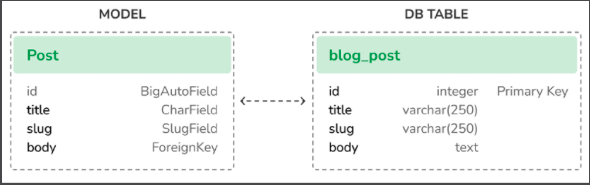
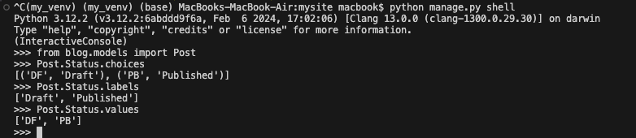

# Creating a django application
Let’s create our first Django application. We will build a blog application from scratch. 
Run the following command in the shell prompt from the project’s root directory:
<pre>
```

python manage.py startapp blog

```
</pre>
This will create the basic structure of the application, which will look like this:
blog/
    __init__.py
    admin.py
    apps.py
    migrations/
        __init__.py
    models.py
    tests.py
    views.py

# These files are as follow

__init__.py: An empty file that tells Python to treat the blog directory as a Python module.
admin.py: This is where you register models to include them in the Django administration site—using this site is optional.
apps.py: This includes the main configuration of the blog application.
migrations: This directory will contain database migrations of the application. Migrations allow Django to track your model
changes and synchronize the database accordingly. This directory contains an empty __init__.py file.
models.py: This includes the data models of your application; all Django applications need to have a models.py file but it can be left empty.
tests.py: This is where you can add tests for your application.
views.py: The logic of your application goes here; each view receives an HTTP request, processes it, and returns a response.

With the application structure ready, we can start building the data models for the blog.

# Creating the blog's data models

Remember that a Python object is a collection of data and methods. Classes are the blueprint for bundling data and functionality together. Creating a new class creates a new type of object, allowing you to create instances of that type.
A Django model is a source of information and behaviors of your data. It consists of a Python class that subclasses django.db.models.Model. Each model maps to a single database table, where each attribute of the class represents a database field. When you create a model, Django will provide you with a practical API to query objects in the database easily.
We will define the database models for our blog application. Then, we will generate the database migrations for the models to create the corresponding database tables. When applying the migrations, Django will create a table for each model defined in the models.py file of the application.

# Creating the post models

First, we will define a Post model that will allow us to store blog posts in the database.
Add the following lines to the models.py file of the blog application. The new lines are highlighted in bold:

<pre>
```

from django.db import models
class Post(models.Model):
    title = models.CharField(max_length=250)
    slug = models.SlugField(max_length=250)
    body = models.TextField()
    def __str__(self):
        return self.title

 ```
</pre>

“This is the data model for blog posts. Posts will have a title, a short label called slug, and a body. Let’s take a look at the fields of this model:

title: This is the field for the post title. This is a CharField field that translates into a VARCHAR column in the SQL database.
slug: This is a SlugField field that translates into a VARCHAR column in the SQL database. A slug is a short label that contains only letters, numbers, underscores, or hyphens. A post with the title Django Reinhardt: A legend of Jazz could have a slug like django-reinhardt-legend-jazz. We will use the slug field to build beautiful, SEO-friendly URLs for blog posts in Chapter 2, Enhancing Your Blog with Advanced Features.
body: This is the field for storing the body of the post. This is a TextField field that translates into a TEXT column in the SQL database.

We have also added a __str__() method to the model class. This is the default Python method to return a string with the human-readable representation of the object. Django will use this method to display the name of the object in many places, such as the Django administration site.


Let’s take a look at how the model and its fields will be translated into a database table and columns. The following diagram shows the Post model and the corresponding database table that Django will create when we synchronize the model to the database:

* 

Figure 1.4: Initial Post model and database table correspondence *
Django will create a database column for each of the model fields: title, slug, and body. You can see how each field type corresponds to a database data type.
By default, Django adds an auto-incrementing primary key field to each model. The field type for this field is specified in each application configuration or globally in the DEFAULT_AUTO_FIELD setting. When creating an application with the startapp command, the default value for DEFAULT_AUTO_FIELD is BigAutoField. This is a 64-bit integer that automatically increments according to available IDs. If you don’t specify a primary key for your model, Django adds this field automatically. You can also define one of the model fields to be the primary key by setting primary_key=True on it.
We will expand the Post model with additional fields and behaviors. Once complete, we will synchronize it to the database by creating a database migration and applying it.

# Adding date time fields

We will continue by adding different datetime fields to the Post model. Each post will be published at a specific date and time. Therefore, we need a field to store the publication date and time. We also want to store the date and time when the Post object was created, and when it was last modified.

Edit the models.py file of the blog application to make it look like this. The new lines are highlighted in bold:

<pre>
```
from django.db import models
from django.utils import timezone
class Post(models.Model):
    title = models.CharField(max_length=250)
    slug = models.SlugField(max_length=250)
    body = models.TextField()
    publish = models.DateTimeField(default=timezone.now)
    created = models.DateTimeField(auto_now_add=True)
    updated = models.DateTimeField(auto_now=True)
    def __str__(self):
        return self.title
```
</pre>
We have added the following fields to the Post model:

publish: This is a DateTimeField field that translates into a DATETIME column in the SQL database. We will use it to store the date and time when the post was published. We use Django’s timezone.now method as the default value for the field. Note that we imported the timezone module to use this method. timezone.now returns the current datetime in a timezone-aware format. You can think of it as a timezone-aware version of the standard Python of it as a timezone-aware version of the standard Python datetime.now method.
created: This is a DateTimeField field. We will use it to store the date and time when the post was created. By using auto_now_add, the date will be saved automatically when creating an object.
updated: This is a DateTimeField field. We will use it to store the last date and time when the post was updated. By using auto_now, the date will be updated automatically when saving an object.

# Defining a default sort order

Blog posts are usually displayed in reverse chronological order (from newest to oldest). We will define a default ordering for our model. The default order will apply when obtaining objects from the database when no order is specified in the query.
Edit the models.py file of the blog application to make it look like this. The new lines are highlighted in bold:
<pre>
```
from django.db import models
from django.utils import timezone
class Post(models.Model):
    title = models.CharField(max_length=250)
    slug = models.SlugField(max_length=250)
    body = models.TextField()
    publish = models.DateTimeField(default=timezone.now)
    created = models.DateTimeField(auto_now_add=True)
    updated = models.DateTimeField(auto_now=True)
    class Meta:
        ordering = ['-publish']
    def __str__(self):
        return self.title
```
</pre>
We have added a Meta class inside the model. This class defines metadata for the model. We use the ordering attribute to tell Django that it should sort results by the publish field. This ordering will apply by default for database queries when no specific order is provided in the query. We indicate descending order by using a hyphen before the field name, -publish. Posts will be returned in reverse chronological order by default.

# Adding a database index

Let’s define a database index for the publish field. This will improve performance for queries filtering or ordering results by this field. We expect many queries to take advantage of this index since we are using the publish field to order results by default.
Edit the models.py file of the blog application and make it look like this. The new lines are highlighted in bold:
<pre>
```
from django.db import models
from django.utils import timezone
class Post(models.Model):
    title = models.CharField(max_length=250)
    slug = models.SlugField(max_length=250)
    body = models.TextField()
    publish = models.DateTimeField(default=timezone.now)
    created = models.DateTimeField(auto_now_add=True)
    updated = models.DateTimeField(auto_now=True)
    class Meta:
        ordering = ['-publish']
        indexes = [
            models.Index(fields=['-publish']),
        ]
    def __str__(self):
        return self.title
```
</pre>

We have added the indexes option to the model’s Meta class. This option allows you to define database indexes for your model, which could comprise one or multiple fields, in ascending or descending order, or functional expressions and database functions. We have added an index for the publish field. We use a hyphen before the field name to define the index in descending order. The creation of this index will be included in the database migrations that we will generate later for our blog models.

# Activating the application

We need to activate the blog application in the project, for Django to keep track of the application and be able to create database tables for its models.
Edit the settings.py file and add blog.apps.BlogConfig to the INSTALLED_APPS setting. It should look like this. The new lines are highlighted in bold:
<pre>
```
INSTALLED_APPS = [
    'django.contrib.admin',
    'django.contrib.auth',
    'django.contrib.contenttypes',
    'django.contrib.sessions',
    'django.contrib.messages',
    'django.contrib.staticfiles',
    'blog.apps.BlogConfig',
]
```
</pre>
The BlogConfig class is the application configuration. Now Django knows that the application is active for this project and will be able to load the application models.

# Adding a status field

A common functionality for blogs is to save posts as a draft until ready for publication. We will add a status field to our model that will allow us to manage the status of blog posts. We will be using Draft and Published statuses for posts.
Edit the models.py file of the blog application to make it look as follows. The new lines are highlighted in bold:
<pre>
```
from django.db import models
from django.utils import timezone
class Post(models.Model):
    class Status(models.TextChoices):
        DRAFT = 'DF', 'Draft'
        PUBLISHED = 'PB', 'Published'
    title = models.CharField(max_length=250)
    slug = models.SlugField(max_length=250)
    body = models.TextField()
    publish = models.DateTimeField(default=timezone.now)
    created = models.DateTimeField(auto_now_add=True)
    updated = models.DateTimeField(auto_now=True)
    status = models.CharField(max_length=2,
                              choices=Status.choices,
                              default=Status.DRAFT)
    class Meta:
        ordering = ['-publish']
           indexes = [
            models.Index(fields=['-publish']),
        ]
    def __str__(self):
        return self.title
```
</pre>

We have defined the enumeration class Status by subclassing models.TextChoices. The available choices for the post status are DRAFT and PUBLISHED. Their respective values are DF and PB, and their labels or readable names are Draft and Published.
Django provides enumeration types that you can subclass to define choices simply. These are based on the enum object of Python’s standard library. You can read more about enum at https://docs.python.org/3/library/enum.xhtml.
Django enumeration types present some modifications over enum. You can learn about those differences at https://docs.djangoproject.com/en/4.1/ref/models/fields/#enumeration-types.
We can access Post.Status.choices to obtain the available choices, Post.Status.labels to obtain the human-readable names, and Post.Status.values to obtain the actual values of the choices.

We have also added a new status field to the model that is an instance of CharField. It includes a choices parameter to limit the value of the field to the choices in Status.choices. We have also set a default value for the field using the default parameter. We use DRAFT as the default choice for this field.

* It’s a good practice to define choices inside the model class and use the enumeration types. This will allow you to easily reference choice labels, values, or names from anywhere in your code. You can import the Post model and use Post.Status.DRAFT as a reference for the Draft status anywhere in your code.*

# Let’s take a look at how to interact with the status choices. 
Run the following command in the shell prompt to open the Python shell:

python manage.py shell

Then, type the following lines:

>>> from blog.models import Post
>>> Post.Status.choices

You will obtain the enum choices with value-label pairs like this:
[('DF', 'Draft'), ('PB', 'Published')]

Type the following line:
>>> Post.Status.labels

You will get the human-readable names of the enum members as follows:
['Draft', 'Published']

Type the following line:
>>> Post.Status.values


You can access a specific lookup enumeration member with Post.Status.PUBLISHED and you can access its .name and .value properties as well.

# Adding a many to one relationship

Posts are always written by an author. We will create a relationship between users and posts that will indicate which user wrote which posts.``` Django comes with an authentication framework that handles user accounts```. The Django authentication framework comes in the `django.contrib.auth package and contains a User model.` We will use the User model from the Django authentication framework to create a `relationship` between `users and posts`.
Edit the models.py file of the blog application to make it look like this. The new lines are highlighted in bold:
<pre>
```
from django.db import models
from django.utils import timezone
from django.contrib.auth.models import User
class Post(models.Model):
    class Status(models.TextChoices):
        DRAFT = 'DF', 'Draft'
        PUBLISHED = 'PB', 'Published'
    title = models.CharField(max_length=250)
    slug = models.SlugField(max_length=250)
    author = models.ForeignKey(User,
                               on_delete=models.CASCADE,
                               related_name='blog_posts')
    body = models.TextField()
    publish = models.DateTimeField(default=timezone.now)
    created = models.DateTimeField(auto_now_add=True)
    updated = models.DateTimeField(auto_now=True)
    status = models.CharField(max_length=2,
                              choices=Status.choices,
                              default=Status.DRAFT)
    class Meta:
        ordering = ['-publish']
        indexes = [
            models.Index(fields=['-publish']),
        ]
    def __str__(self):
        return self.title
```
</pre>

We have imported the `User model from the django.contrib.auth.models module` and we have added an `author` field to the Post model. This field defines a many-to-one relationship, meaning that each post is written by a user, and a user can write any number of posts. For this field, Django will create a foreign key in the database using the primary key of the related model.

The on_delete parameter specifies the behavior to adopt when the referenced object is deleted. This is not specific to Django; it is an SQL standard. Using CASCADE, you specify that when the referenced user is deleted, the database will also delete all related blog posts. You can take a look at all the possible options at https://docs.djangoproject.com/en/4.1/ref/models/fields/#django.db.models.ForeignKey.on_delete. 
We use related_name to specify the name of the reverse relationship, from User to Post. This will allow us to access related objects easily from a user object by using the user.blog_posts notation. We will learn more about this later.
Django comes with different types of fields that you can use to define your models. You can find all field types at https://docs.djangoproject.com/en/4.1/ref/models/fields/.
The Post model is now complete, and we can now `synchronize` it to the database. But before that, we need to `activate the blog application in our Django project`.
