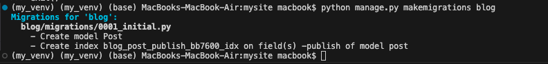

# Creating and applying migrations

Now that we have a data model for blog posts, we need to create the corresponding database table. Django comes with a migration system that tracks the changes made to models and enables them to propagate into the database.
The migrate command applies migrations for all applications listed in INSTALLED_APPS. It synchronizes the database with the current models and existing migrations.
First, we will need to create an initial migration for our Post model. 
Run the following command in the shell prompt from the root directory of your project:
<pre>
```
python manage.py makemigrations blog
```
</pre>
You should get an output similar to the following one:
<pre>
```
Migrations for 'blog':
    blog/migrations/0001_initial.py
        - Create model Post
        - Create index blog_post_publish_bb7600_idx on field(s)
          -publish of model post
```
</pre>


Django just created the 0001_initial.py file inside the migrations directory of the blog application. This migration contains the SQL statements to create the database table for the Post model and the definition of the database index for the publish field. 
You can take a look at the file contents to see how the migration is defined. A migration specifies dependencies on other migrations and operations to perform in the database to synchronize it with model changes.
Let’s take a look at the SQL code that Django will execute in the database to create the table for your model. The sqlmigrate command takes the migration names and returns their SQL without executing it.
Run the following command from the shell prompt to inspect the SQL output of your first migration:

<pre>
```
python manage.py sqlmigrate blog 0001
```
</pre>

The output should look as follows:

<pre>
```
“BEGIN;
--
-- Create model Post
--
CREATE TABLE "blog_post" (
  "id" integer NOT NULL PRIMARY KEY AUTOINCREMENT,
  "title" varchar(250) NOT NULL,
  "slug" varchar(250) NOT NULL,
  "body" text NOT NULL,
  "publish" datetime NOT NULL,
  "created" datetime NOT NULL,
  "updated" datetime NOT NULL,
  "status" varchar(10) NOT NULL,
  "author_id" integer NOT NULL REFERENCES "auth_user" ("id") DEFERRABLE INITIALLY DEFERRED);
--
-- Create blog_post_publish_bb7600_idx on field(s) -publish of model post
--
CREATE INDEX "blog_post_publish_bb7600_idx" ON "blog_post" ("publish" DESC);
CREATE INDEX "blog_post_slug_b95473f2" ON "blog_post" ("slug");
CREATE INDEX "blog_post_author_id_dd7a8485" ON "blog_post" ("author_id");
COMMIT;
```
</pre>


The exact output depends on the database you are using. The preceding output is generated for SQLite. As you can see in the output, Django generates the table names by combining the application name and the lowercase name of the model (blog_post), but you can also specify a custom database name for your model in the Meta class of the model using the db_table attribute.
Django creates an auto-incremental id column used as the primary key for each model, but you can also override this by specifying primary_key=True on one of your model fields. The default id column consists of an integer that is incremented automatically. This column corresponds to the id field that is automatically added to your model.
The following three database indexes are created:

An index with descending order on the publish column. This is the index we explicitly defined with the indexes option of the model’s Meta class.
An index on the slug column because SlugField fields imply an index by default.
An index on the author_id column because ForeignKey fields imply an index by default.

Let’s compare the Post model with its corresponding database blog_post table:


Let’s sync the database with the new model. 
Execute the following command in the shell prompt to apply existing migrations:
python manage.py migrate

You will get an output that ends with the following line:

Applying blog.0001_initial... OK

We just applied migrations for the applications listed in INSTALLED_APPS, including the blog application. After applying the migrations, the database reflects the current status of the models.
If you `edit` the `models.py` file in order to add, remove, or change the fields of existing models, or `if you add new models`, `you will have to create a new migration` using the `makemigrations command`. Each migration allows Django to keep track of model changes. Then, you will have to apply the migration using the migrate command to keep the database in sync with your models.