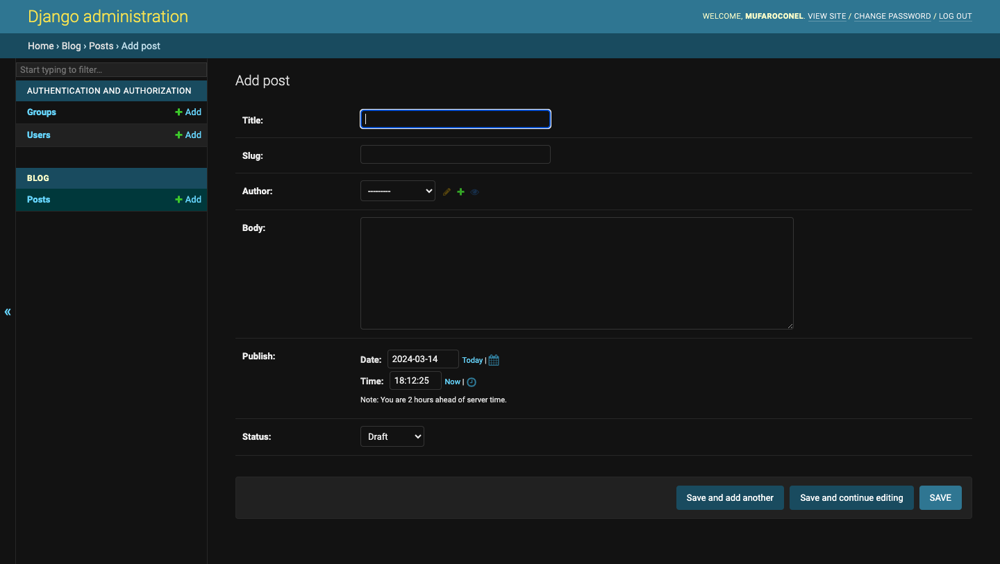
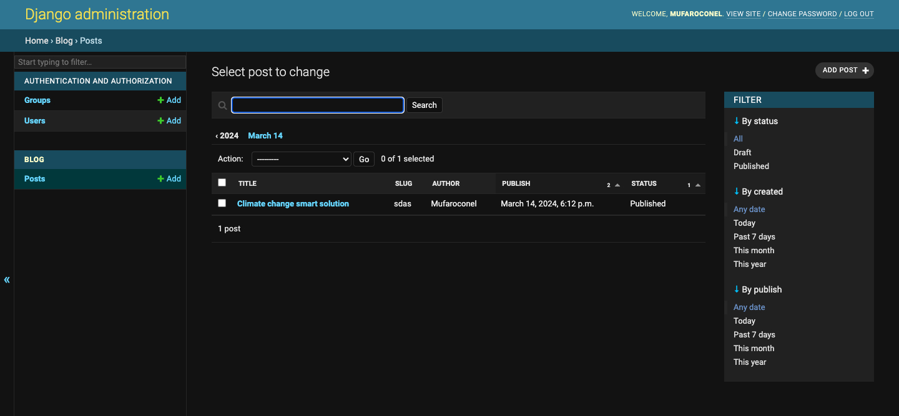

# Creating an administrator site for models
Now that the Post model is in sync with the database, we can create a simple administration site to manage blog posts.
Django comes with a built-in administration interface that is very useful for editing content. The Django site is built dynamically by reading the model metadata and providing a production-ready interface for editing content. You can use it out of the box, configuring how you want your models to be displayed in it.
The django.contrib.admin application is already included in the INSTALLED_APPS setting, so you don’t need to add it.

Creating a superuser
First, you will need to create a user to manage the administration site. Run the following command:
<pre>
```
python manage.py createsuperuser
```
<pre>

You will see the following output. Enter your desired username, email, and password, as follows:

<pre>
```
Username (leave blank to use 'admin'): admin
Email address: admin@admin.com
Password: ********
Password (again): ********
```
</pre>

Then you will see the following success message:

<pre>
```
Superuser created successfully.
```
</pre>

We just created an administrator user with the highest permissions.

The Django administration site
Start the development server with the following command:
<pre>
```
python manage.py runserver
```
</pre>

Open http://127.0.0.1:8000/admin/ in your browser. You should see the administration login page, as shown in Figure 1.6:

Log in using the credential created and the administrator site page will open


# The group and user model

The Group and User models that you can see in the preceding screenshot are part of the Django authentication framework located in django.contrib.auth. If you click on Users, you will see the user you created previously.

# Adding models to the administration site

Adding models to the administration site
Let’s add your blog models to the administration site. Edit the `admin.py` file of the blog application and make it look like this. The new lines are highlighted in bold:
<pre>
```
from django.contrib import admin
from .models import Post
admin.site.register(Post)
```
</pre>
Now reload the administration site in your browser. You should see your Post model on the site, as follows:


That was easy, right? When you register a model in the Django administration site, you get a user-friendly interface generated by introspecting your models that allows you to list, edit, create, and delete objects in a simple way.
Click on the Add link beside Posts to add a new post. You will note the form that Django has generated dynamically for your model, as shown in Figure 1.9:


Django uses different form widgets for each type of field. Even complex fields, such as the DateTimeField, are displayed with an easy interface, such as a JavaScript date picker.
Fill in the form and click on the SAVE button. You should be redirected to the post list pa ge with a success message and the post you just created, as shown in Figure 1.10:


# Customizing how models are displayed

Now, we will take a look at how to customize the administration site.

`Edit` the `admin.py` file of your blog application and change it, as follows. The new lines are highlighted in bold:
<pre>
```
from django.contrib import admin
from .models import Post
@admin.register(Post)
class PostAdmin(admin.ModelAdmin):
    list_display = ['title', 'slug', 'author', 'publish', 'status']
```
</pre>

We are telling the Django administration site that the model is registered in the site using a custom class that inherits from ModelAdmin. In this class, we can include information about how to display the model on the site and how to interact with it.

The list_display attribute allows you to set the fields of your model that you want to display on the administration object list page. The `@admin.register()` decorator performs the same function as the `admin.site.register()` function that you replaced, registering the ModelAdmin class that it decorates.
Let’s customize the admin model with some more options.

Edit the `admin.py` file of your blog application and change it, as follows. The new lines are highlighted in bold:
<pre>
```
from django.contrib import admin
from .models import Post
@admin.register(Post)
class PostAdmin(admin.ModelAdmin):
    list_display = ['title', 'slug', 'author', 'publish', 'status']
    list_filter = ['status', 'created', 'publish', 'author']
    search_fields = ['title', 'body']
    prepopulated_fields = {'slug': ('title',)}
    raw_id_fields = ['author']
    date_hierarchy = 'publish'
    ordering = ['status', 'publish']
```
</pre>

Return to your browser and reload the post list page. Now, it will look like this:



#### Code explanation

## Code Explanation (Django Admin)

This code snippet defines a class named `PostAdmin` to customize the administration interface for the `Post` model in a Django application. Here's a breakdown line by line:

**Line 1:**

```python
from django.contrib import admin
```

* **Import:** This line imports the `admin` module from the `django.contrib` package. The `admin` module provides functionalities for managing models through the Django admin interface.

**Line 2:**

```python
from .models import Post
```

* **Import:** This line imports the `Post` model from the current app's `models.py` file (assuming the code is located within the same app as the `Post` model).

**Line 3:**

```python
@admin.register(Post)
class PostAdmin(admin.ModelAdmin):
```

* **Decorator:** This line uses the `@admin.register` decorator to register the `PostAdmin` class with the Django admin. It essentially tells Django to use this class to customize the admin interface for the `Post` model.
* **Class Definition:** This defines a class named `PostAdmin` that inherits from the `admin.ModelAdmin` base class. This class will hold the customizations for the admin view of the `Post` model.

**Line 4:**

```python
list_display = ['title', 'slug', 'author', 'publish', 'status']
```

* **`list_display`:** This attribute specifies the fields that will be displayed in the list view of the `Post` model in the admin interface. Here, it's a list containing the names of the fields (`title`, `slug`, `author`, `publish`, and `status`) you want to see for each post entry.

**Line 5:**

```python
list_filter = ['status', 'created', 'publish', 'author']
```

* **`list_filter`:** This attribute defines a list of fields that will be used as filters on the sidebar of the post list view. This allows admins to filter posts by these criteria (e.g., filter by published vs. draft posts).

**Line 6:**

```python
search_fields = ['title', 'body']
```

* **`search_fields`:** This attribute specifies which fields can be used for full-text search in the admin interface. Here, the admin can search for posts by their titles and body content.

**Line 7:**

```python
prepopulated_fields = {'slug': ('title',)}
```

* **`prepopulated_fields`:** This dictionary defines fields that should be automatically populated based on other fields. In this case, the `slug` field (often used for URLs) will be automatically generated based on the title of the post.

**Line 8:**

```python
raw_id_fields = ['author']
```

* **`raw_id_fields`:** This attribute specifies fields that should be displayed as a popup window for selecting related objects (foreign keys) in the admin interface. Here, when editing a post, the `author` field will display a popup to choose an existing user from the system.

**Line 9:**

```python
date_hierarchy = 'publish'
```

* **`date_hierarchy`:** This attribute defines the field that should be used to group posts by date in the admin interface. In this case, posts will be grouped by their publish date.

**Line 10:**

```python
ordering = ['status', 'publish']
```

* **`ordering`:** This attribute defines the default order in which posts are displayed in the admin list view. Here, posts will be ordered first by their `status` (e.g., published vs. draft) and then by their publish date (descending order).

In summary, this code snippet configures the Django admin interface for the `Post` model, specifying which fields to display, how to filter and search, and how to manage related objects and ordering within the admin panel.

## Django Admin Interface Customization Explained (Markdown)

This text describes the customizations made to the Django admin interface for managing posts. Here's a breakdown in markdown format with explanations:

**Post List View:**

* **Displayed Fields:** The columns you see for each post (title, slug, author, publish date, and status) are controlled by the `list_display` attribute. You defined this attribute to specify which fields you want to see listed in the admin interface.
* **Filtering:** The right sidebar allows filtering posts based on criteria like status, creation date, publish date, and author. These filter options come from the `list_filter` attribute, which you configured to specify the filterable fields.

**Search Functionality:**

* **Search Fields:** The search bar lets you search for posts by their title and body content. This functionality is enabled by the `search_fields` attribute, defining which fields can be searched.

**Date Hierarchy:**

* **Grouping by Date:** The navigation links below the search bar allow you to browse posts grouped by their publish date. This date-based organization is controlled by the `date_hierarchy` attribute.

**Post Ordering:**

* **Default Sorting:** By default, posts are ordered first by their status (published vs. draft) and then by their publish date (newest first). This default sorting behavior is determined by the `ordering` attribute.

**Adding New Posts:**

* **Slug Prepopulation:** When you enter a title for a new post, the slug field (often used for URLs) is automatically filled in based on the title. This automatic population is achieved using the `prepopulated_fields` attribute, which you configured to link the slug field to the title field.

In summary, these attributes (`list_display`, `list_filter`, `search_fields`, `date_hierarchy`, `ordering`, and `prepopulated_fields`) provide various ways to customize the Django admin interface for managing your post model, making it more efficient and user-friendly.

You can see that the fields displayed on the post list page are the ones we specified in the list_display attribute. The list page now includes a right sidebar that allows you to filter the results by the fields included in the list_filter attribute.
A search bar has appeared on the page. This is because we have defined a list of searchable fields using the search_fields attribute. Just below the search bar, there are navigation links to navigate through a date hierarchy; this has been defined by the date_hierarchy attribute. You can also see“that the posts are ordered by STATUS and PUBLISH columns by default. We have specified the default sorting criteria using the ordering attribute.
Next, click on the ADD POST link. You will also note some changes here. As you type the title of a new post, the slug field is filled in automatically. You have told Django to prepopulate the slug field with the input of the title field using the prepopulated_fields attribute:


Also, the author field is now displayed with a lookup widget, which can be much better than a drop-down select input when you have thousands of users. This is achieved with the raw_id_fields attribute and it looks like this:


With a few lines of code, we have customized the way the model is displayed on the administration site. There are plenty of ways to customize and extend the Django administration site; you will learn more about this later in this book.
You can find more information about the Django administration site at https://docs.djangoproject.com/en/4.1/ref/contrib/admin/.